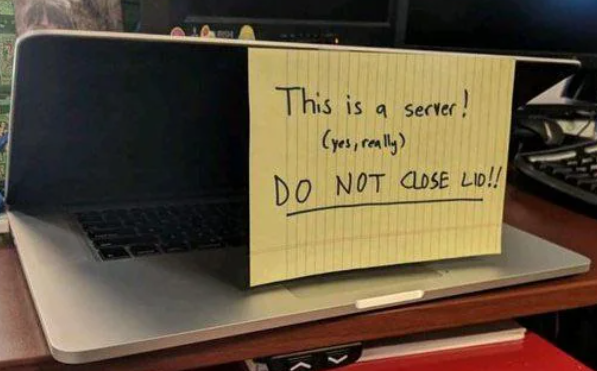

### Hola, soy Felipe Gonzalez.👋

          Soy un desarrollador FullStack 💻 con experiencia en Javascript,
          Typescript, Tailwind, React, Redux y Sequalize. He participado en
          proyectos que destacan por interfaces intuitivas, gestión de estado
          global, integración de API y manejo de bases de datos, brindando una
          sólida base en las últimas tecnologías web.
          
          Actualmente, me encuentro en una pasantía en Awaq ONGD 🌳, donde estoy
          contribuyendo al desarrollo de su futuro sitio web. En este proyecto,
          hemos adoptado metodologías Agile y Scrum para organizar efectivamente
          nuestro trabajo en equipo, permitiendo una planificación iterativa,
          entregas frecuentes y rápida adaptación a los cambios, optimizando la
          eficiencia y la calidad del producto final. Mi enfoque ha estado en
          crear páginas de inicio y un panel funcional para el administrador del
          sitio.
          
          Me considero alguien perseverante 🧠, colaborativo 🤝 y flexible 🤸,
          determinado en las metas y con pensamiento crítico. Y con inglés avanzado (certificado EF Set: https://www.efset.org/cert/2v3btP)

Mi portfolio💼:
 
https://felipe-gonzalez.netlify.app
 
Contáctame🌐:
 
gdfeli05@gmail.com ✉️
 
<a href="https://www.linkedin.com/in/felipe-gonzález-delgado-834950212/">Mi LinkedIn</a>
 
<a href="https://github.com/FelipeGD29/">Mi Github</a>

